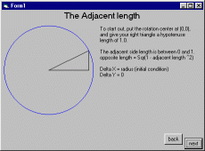



## anatomy of point rotation

### Description

This project is a somewhat interactive tutorial on the fundamentals involved in rotating a point around a center (0,0).
 
### More Info
 

             |
---                |---
**Submitted On**   |2004-07-15 02:05:28
**By**             |[dafhi](https://github.com/Planet-Source-Code/PSCIndex/blob/master/ByAuthor/dafhi.md)
**Level**          |Intermediate
**User Rating**    |5.0 (15 globes from 3 users)
**Compatibility**  |VB 6\.0
**Category**       |[Math/ Dates](https://github.com/Planet-Source-Code/PSCIndex/blob/master/ByCategory/math-dates__1-37.md)
**World**          |[Visual Basic](https://github.com/Planet-Source-Code/PSCIndex/blob/master/ByWorld/visual-basic.md)
**Archive File**   |[anatomy\_of1770017152004\.zip](https://github.com/Planet-Source-Code/dafhi-anatomy-of-point-rotation__1-54959/archive/master.zip)

